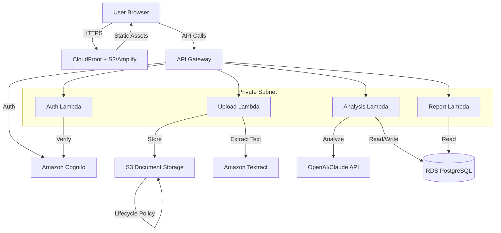
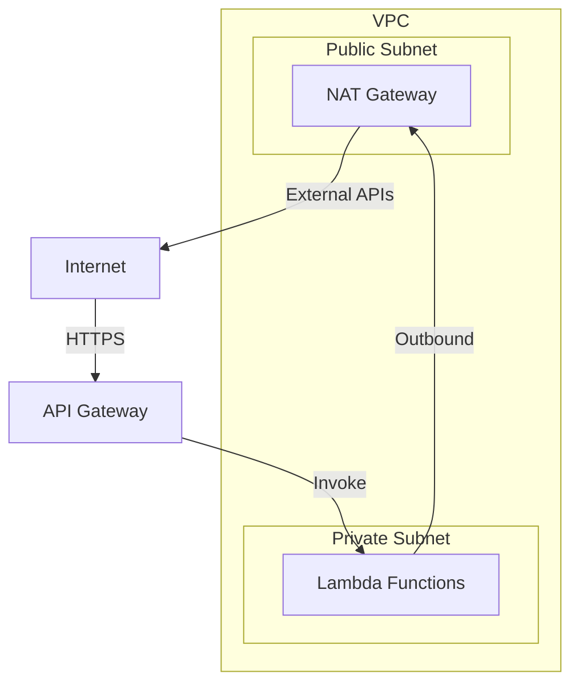

# Design Document: NiyamAI Risk Checker

## Overview

NiyamAI is a serverless web application built on AWS that provides AI-powered risk analysis for small businesses. The system analyzes uploaded documents (contracts, invoices) and questionnaire responses to identify legal, GST compliance, and cybersecurity risks.

The architecture follows a three-tier serverless pattern:
- **Frontend**: Next.js application hosted on AWS Amplify or S3 + CloudFront
- **API Layer**: AWS API Gateway with Lambda functions in private subnets
- **Data Layer**: S3 for document storage, RDS PostgreSQL or DynamoDB for structured data
- **External Services**: Amazon Textract for OCR, OpenAI/Claude for AI analysis

Key design principles:
- Security-first: All data encrypted, private subnets, no public database access
- Serverless scalability: Auto-scaling Lambda functions
- Cost-effective: Pay-per-use model suitable for hackathon/prototype
- Privacy-focused: Automatic document deletion after 7 days

## Architecture

### System Components



### Network Architecture



### Data Flow

**Document Upload and Analysis Flow:**
1. User authenticates via Cognito (JWT token)
2. User uploads document through frontend
3. Frontend calls API Gateway with JWT
4. API Gateway validates token and invokes Upload Lambda
5. Upload Lambda stores document in S3 with encryption
6. Upload Lambda submits document to Textract for OCR
7. Textract returns extracted text
8. Upload Lambda stores text in database
9. Upload Lambda triggers Analysis Lambda asynchronously
10. Analysis Lambda sends text to AI service with risk detection prompt
11. AI service returns identified risks and recommendations
12. Analysis Lambda calculates risk score
13. Analysis Lambda stores results in database
14. Frontend polls or receives notification of completion
15. User views results on Dashboard

**Security Questionnaire Flow:**
1. User completes questionnaire in frontend
2. Frontend submits responses to API Gateway
3. Analysis Lambda evaluates responses against security best practices
4. Analysis Lambda calculates security risk score
5. Analysis Lambda generates recommendations
6. Results stored in database and displayed on Dashboard

## Components and Interfaces

### Frontend (Next.js)

**Pages:**
- `/login` - Authentication page
- `/register` - User registration
- `/dashboard` - Main dashboard showing all assessments
- `/upload/contract` - Contract upload and analysis
- `/upload/invoice` - Invoice upload and analysis
- `/security-check` - Security questionnaire
- `/report/:id` - Detailed assessment report

**Key Components:**
- `AuthProvider` - Manages Cognito authentication state
- `DocumentUploader` - Handles file upload with progress
- `RiskScoreCard` - Displays risk scores with severity indicators
- `ActionItemList` - Shows prioritized recommendations
- `SecurityQuestionnaire` - Multi-step form for security assessment
- `ReportExporter` - Generates and downloads PDF reports

**API Client:**
```typescript
interface APIClient {
  // Authentication
  login(email: string, password: string): Promise<AuthToken>
  register(email: string, password: string): Promise<User>
  
  // Document operations
  uploadDocument(file: File, type: 'contract' | 'invoice'): Promise<UploadResponse>
  getDocumentStatus(documentId: string): Promise<DocumentStatus>
  
  // Analysis operations
  getAnalysisResults(documentId: string): Promise<AnalysisResult>
  submitSecurityQuestionnaire(responses: QuestionnaireResponse[]): Promise<SecurityAssessment>
  
  // Dashboard and reports
  getDashboardData(): Promise<DashboardData>
  generateReport(assessmentIds: string[]): Promise<ReportURL>
}
```

### Backend Lambda Functions

**Auth Lambda:**
```typescript
interface AuthLambda {
  // Validates JWT tokens from Cognito
  validateToken(token: string): Promise<UserContext>
  
  // Handles user context for requests
  getUserContext(userId: string): Promise<UserProfile>
}
```

**Upload Lambda:**
```typescript
interface UploadLambda {
  // Handles document upload
  uploadDocument(
    userId: string,
    file: Buffer,
    filename: string,
    documentType: 'contract' | 'invoice'
  ): Promise<DocumentRecord>
  
  // Triggers OCR processing
  extractText(s3Key: string): Promise<string>
  
  // Stores extracted text
  storeExtractedText(documentId: string, text: string): Promise<void>
  
  // Triggers analysis
  triggerAnalysis(documentId: string): Promise<void>
}
```

**Analysis Lambda:**
```typescript
interface AnalysisLambda {
  // Analyzes contract risks
  analyzeContract(documentId: string, text: string): Promise<ContractAnalysis>
  
  // Analyzes invoice compliance
  analyzeInvoice(documentId: string, text: string): Promise<InvoiceAnalysis>
  
  // Evaluates security questionnaire
  evaluateSecurityQuestionnaire(
    userId: string,
    responses: QuestionnaireResponse[]
  ): Promise<SecurityAssessment>
  
  // Calculates risk scores
  calculateRiskScore(issues: Issue[]): number
  
  // Generates recommendations
  generateRecommendations(issues: Issue[]): Recommendation[]
}
```

**Report Lambda:**
```typescript
interface ReportLambda {
  // Generates PDF report
  generateReport(userId: string, assessmentIds: string[]): Promise<string>
  
  // Retrieves report data
  getReportData(assessmentIds: string[]): Promise<ReportData>
}
```

### External Service Integrations

**Amazon Textract Integration:**
```typescript
interface TextractService {
  // Submits document for OCR
  startDocumentTextDetection(s3Bucket: string, s3Key: string): Promise<string>
  
  // Retrieves OCR results
  getDocumentTextDetection(jobId: string): Promise<TextractResult>
  
  // Extracts structured text
  extractText(result: TextractResult): string
}
```

**AI Service Integration:**
```typescript
interface AIService {
  // Analyzes contract for risks
  analyzeContractRisks(text: string): Promise<AIAnalysisResult>
  
  // Analyzes invoice for compliance
  analyzeInvoiceCompliance(text: string): Promise<AIAnalysisResult>
  
  // Handles retries with exponential backoff
  callWithRetry<T>(operation: () => Promise<T>, maxRetries: number): Promise<T>
}

interface AIAnalysisResult {
  risks: Risk[]
  recommendations: Recommendation[]
  confidence: number
}

interface Risk {
  category: string
  severity: 'low' | 'medium' | 'high'
  description: string
  location?: string  // Clause or section reference
}

interface Recommendation {
  issue: string
  suggestion: string
  priority: number
}
```

**AI Prompts:**

Contract Analysis Prompt:
```
You are a legal risk analyzer for small businesses. Analyze the following contract and identify:
1. Risky clauses (unlimited liability, unfavorable termination, IP issues)
2. Missing protections (confidentiality, dispute resolution, payment terms)
3. One-sided terms that favor the other party

For each issue found, provide:
- Category (liability, termination, payment, IP, etc.)
- Severity (low, medium, high)
- Clear explanation in simple language
- Specific suggestion for improvement

Contract text:
{extracted_text}
```

Invoice Analysis Prompt:
```
You are a GST compliance checker for Indian businesses. Analyze the following invoice and check for:
1. Required GST fields: GSTIN, Invoice Number, Date, HSN/SAC codes, Tax amounts (CGST, SGST, IGST)
2. Correct invoice structure and format
3. Calculation accuracy

For each issue found, provide:
- Field name or issue type
- Description of the problem
- Specific correction needed

Invoice text:
{extracted_text}
```

## Data Models

### Database Schema (PostgreSQL)

**Users Table:**
```sql
CREATE TABLE users (
  id UUID PRIMARY KEY DEFAULT gen_random_uuid(),
  cognito_user_id VARCHAR(255) UNIQUE NOT NULL,
  email VARCHAR(255) UNIQUE NOT NULL,
  business_name VARCHAR(255),
  created_at TIMESTAMP DEFAULT CURRENT_TIMESTAMP,
  updated_at TIMESTAMP DEFAULT CURRENT_TIMESTAMP
);
```

**Documents Table:**
```sql
CREATE TABLE documents (
  id UUID PRIMARY KEY DEFAULT gen_random_uuid(),
  user_id UUID NOT NULL REFERENCES users(id) ON DELETE CASCADE,
  s3_key VARCHAR(500) NOT NULL,
  filename VARCHAR(255) NOT NULL,
  document_type VARCHAR(50) NOT NULL, -- 'contract' or 'invoice'
  file_size INTEGER NOT NULL,
  upload_date TIMESTAMP DEFAULT CURRENT_TIMESTAMP,
  deletion_date TIMESTAMP NOT NULL, -- upload_date + 7 days
  extracted_text TEXT,
  ocr_status VARCHAR(50) DEFAULT 'pending', -- 'pending', 'processing', 'completed', 'failed'
  INDEX idx_user_documents (user_id),
  INDEX idx_deletion_date (deletion_date)
);
```

**Assessments Table:**
```sql
CREATE TABLE assessments (
  id UUID PRIMARY KEY DEFAULT gen_random_uuid(),
  user_id UUID NOT NULL REFERENCES users(id) ON DELETE CASCADE,
  document_id UUID REFERENCES documents(id) ON DELETE SET NULL,
  assessment_type VARCHAR(50) NOT NULL, -- 'contract', 'invoice', 'security'
  risk_score INTEGER NOT NULL CHECK (risk_score >= 0 AND risk_score <= 100),
  severity VARCHAR(20) NOT NULL, -- 'low', 'medium', 'high'
  status VARCHAR(50) DEFAULT 'completed', -- 'pending', 'processing', 'completed', 'failed'
  created_at TIMESTAMP DEFAULT CURRENT_TIMESTAMP,
  INDEX idx_user_assessments (user_id),
  INDEX idx_assessment_type (assessment_type)
);
```

**Risks Table:**
```sql
CREATE TABLE risks (
  id UUID PRIMARY KEY DEFAULT gen_random_uuid(),
  assessment_id UUID NOT NULL REFERENCES assessments(id) ON DELETE CASCADE,
  category VARCHAR(100) NOT NULL,
  severity VARCHAR(20) NOT NULL,
  description TEXT NOT NULL,
  location TEXT, -- Clause reference or section
  created_at TIMESTAMP DEFAULT CURRENT_TIMESTAMP,
  INDEX idx_assessment_risks (assessment_id)
);
```

**Recommendations Table:**
```sql
CREATE TABLE recommendations (
  id UUID PRIMARY KEY DEFAULT gen_random_uuid(),
  assessment_id UUID NOT NULL REFERENCES assessments(id) ON DELETE CASCADE,
  issue TEXT NOT NULL,
  suggestion TEXT NOT NULL,
  priority INTEGER NOT NULL,
  created_at TIMESTAMP DEFAULT CURRENT_TIMESTAMP,
  INDEX idx_assessment_recommendations (assessment_id)
);
```

**Security Questionnaire Responses Table:**
```sql
CREATE TABLE security_responses (
  id UUID PRIMARY KEY DEFAULT gen_random_uuid(),
  assessment_id UUID NOT NULL REFERENCES assessments(id) ON DELETE CASCADE,
  question_id VARCHAR(100) NOT NULL,
  question_text TEXT NOT NULL,
  response TEXT NOT NULL,
  score INTEGER, -- Individual question score
  created_at TIMESTAMP DEFAULT CURRENT_TIMESTAMP,
  INDEX idx_assessment_responses (assessment_id)
);
```

### TypeScript Data Models

```typescript
interface User {
  id: string
  cognitoUserId: string
  email: string
  businessName?: string
  createdAt: Date
  updatedAt: Date
}

interface Document {
  id: string
  userId: string
  s3Key: string
  filename: string
  documentType: 'contract' | 'invoice'
  fileSize: number
  uploadDate: Date
  deletionDate: Date
  extractedText?: string
  ocrStatus: 'pending' | 'processing' | 'completed' | 'failed'
}

interface Assessment {
  id: string
  userId: string
  documentId?: string
  assessmentType: 'contract' | 'invoice' | 'security'
  riskScore: number
  severity: 'low' | 'medium' | 'high'
  status: 'pending' | 'processing' | 'completed' | 'failed'
  createdAt: Date
  risks: Risk[]
  recommendations: Recommendation[]
}

interface Risk {
  id: string
  assessmentId: string
  category: string
  severity: 'low' | 'medium' | 'high'
  description: string
  location?: string
  createdAt: Date
}

interface Recommendation {
  id: string
  assessmentId: string
  issue: string
  suggestion: string
  priority: number
  createdAt: Date
}

interface SecurityResponse {
  id: string
  assessmentId: string
  questionId: string
  questionText: string
  response: string
  score?: number
  createdAt: Date
}

interface DashboardData {
  user: User
  recentAssessments: Assessment[]
  overallRiskScore: number
  actionItems: Recommendation[]
  documentCount: number
}
```

### Security Questionnaire Structure

```typescript
interface SecurityQuestion {
  id: string
  category: 'passwords' | 'devices' | 'data' | 'access'
  text: string
  options: SecurityOption[]
  weight: number // Importance for scoring
}

interface SecurityOption {
  value: string
  label: string
  score: number // 0-100, higher is better
}

const SECURITY_QUESTIONNAIRE: SecurityQuestion[] = [
  {
    id: 'pwd_policy',
    category: 'passwords',
    text: 'How do you manage passwords for business accounts?',
    options: [
      { value: 'written', label: 'Written down or same password everywhere', score: 0 },
      { value: 'memory', label: 'Different passwords, memorized', score: 40 },
      { value: 'manager', label: 'Password manager', score: 100 }
    ],
    weight: 1.5
  },
  {
    id: 'mfa_usage',
    category: 'passwords',
    text: 'Do you use two-factor authentication (2FA/MFA)?',
    options: [
      { value: 'no', label: 'No', score: 0 },
      { value: 'some', label: 'On some important accounts', score: 60 },
      { value: 'all', label: 'On all business accounts', score: 100 }
    ],
    weight: 2.0
  },
  {
    id: 'device_security',
    category: 'devices',
    text: 'Are your work devices password/PIN protected?',
    options: [
      { value: 'no', label: 'No protection', score: 0 },
      { value: 'some', label: 'Some devices protected', score: 50 },
      { value: 'all', label: 'All devices protected', score: 100 }
    ],
    weight: 1.5
  },
  {
    id: 'software_updates',
    category: 'devices',
    text: 'How often do you update software and operating systems?',
    options: [
      { value: 'rarely', label: 'Rarely or never', score: 0 },
      { value: 'sometimes', label: 'When reminded', score: 50 },
      { value: 'auto', label: 'Automatic updates enabled', score: 100 }
    ],
    weight: 1.2
  },
  {
    id: 'data_backup',
    category: 'data',
    text: 'How do you backup important business data?',
    options: [
      { value: 'no_backup', label: 'No regular backups', score: 0 },
      { value: 'manual', label: 'Manual backups occasionally', score: 40 },
      { value: 'auto_cloud', label: 'Automatic cloud backups', score: 100 }
    ],
    weight: 1.8
  },
  {
    id: 'data_sharing',
    category: 'data',
    text: 'How do you share sensitive business files?',
    options: [
      { value: 'email', label: 'Email attachments', score: 30 },
      { value: 'messaging', label: 'WhatsApp or messaging apps', score: 20 },
      { value: 'secure', label: 'Secure cloud storage with access controls', score: 100 }
    ],
    weight: 1.3
  },
  {
    id: 'access_control',
    category: 'access',
    text: 'How do you manage access to business systems?',
    options: [
      { value: 'shared', label: 'Shared accounts/passwords', score: 0 },
      { value: 'individual', label: 'Individual accounts, no review', score: 60 },
      { value: 'managed', label: 'Individual accounts with regular access review', score: 100 }
    ],
    weight: 1.4
  },
  {
    id: 'wifi_security',
    category: 'access',
    text: 'What type of WiFi do you use for business work?',
    options: [
      { value: 'public', label: 'Public WiFi regularly', score: 0 },
      { value: 'home', label: 'Home WiFi with default password', score: 40 },
      { value: 'secure', label: 'Secured WiFi with strong password', score: 100 }
    ],
    weight: 1.1
  }
]
```


## Correctness Properties

A property is a characteristic or behavior that should hold true across all valid executions of a system—essentially, a formal statement about what the system should do. Properties serve as the bridge between human-readable specifications and machine-verifiable correctness guarantees.

### Property Reflection

After analyzing all acceptance criteria, I've identified the following redundancies to eliminate:

- Properties 4.4, 4.5, and 4.6 (explanations, suggestions, locations for contract risks) can be combined into a single comprehensive property about risk completeness
- Properties 5.3 and 5.4 (warnings and corrections for GST issues) can be combined into a single property about warning completeness
- Properties 8.2 and 8.5 (displaying assessment data) are redundant - one comprehensive property covers both
- Properties 9.1 and 9.2 (report content) can be combined into a single property about report completeness
- Properties 1.1 and 1.2 (registration and login) are separate flows and should remain distinct
- Properties 7.1 and 7.3 (score bounds and severity mapping) can be combined since severity is derived from score bounds

### Authentication and Authorization Properties

**Property 1: User registration creates Cognito account**
*For any* valid email and password combination, when a user registers, the system should successfully create a Cognito account and return a user ID.
**Validates: Requirements 1.1**

**Property 2: Valid login returns JWT token**
*For any* registered user with valid credentials, when they log in, the system should return a valid JWT token that can be verified.
**Validates: Requirements 1.2**

**Property 3: Protected resources require authentication**
*For any* protected API endpoint, when called without a valid JWT token, the system should return a 401 Unauthorized response.
**Validates: Requirements 1.3**

### Document Upload and Storage Properties

**Property 4: File type validation**
*For any* uploaded file, the system should accept PDF, DOC, DOCX, JPG, and PNG formats and reject all other formats with a clear error message.
**Validates: Requirements 2.1**

**Property 5: Document storage with user association**
*For any* uploaded document, the system should store it in S3 with encryption, generate a pre-signed URL, and associate it with the authenticated user's ID.
**Validates: Requirements 2.2, 2.3, 2.6**

**Property 6: Document ownership enforcement**
*For any* document, only the user who uploaded it should be able to access it; attempts by other users should be rejected.
**Validates: Requirements 11.3**

### Text Extraction Properties

**Property 7: Textract integration**
*For any* uploaded document, the system should submit it to Textract for OCR processing and store the extracted text in the database associated with the document.
**Validates: Requirements 3.1, 3.2, 3.4**

**Property 8: Multi-page document handling**
*For any* document with multiple pages, the system should extract text from all pages and preserve the complete content.
**Validates: Requirements 3.5**

### Risk Analysis Properties

**Property 9: Contract risk analysis completeness**
*For any* contract document, when analyzed by the AI service, each identified risk should include a category, severity level, description, suggested improvement, and location reference (when available).
**Validates: Requirements 4.2, 4.4, 4.5, 4.6**

**Property 10: Risk score bounds and severity mapping**
*For any* risk analysis (contract, invoice, or security), the calculated risk score should be between 0 and 100, and should map to the correct severity level (Low: 0-33, Medium: 34-66, High: 67-100).
**Validates: Requirements 4.3, 6.4, 7.1, 7.3**

**Property 11: GST compliance warning completeness**
*For any* invoice with missing or incorrect GST fields, each issue should generate a warning that includes the field name, problem description, and specific correction suggestion.
**Validates: Requirements 5.2, 5.3, 5.4, 5.6**

**Property 12: Security questionnaire scoring**
*For any* completed security questionnaire, the system should calculate a weighted score based on all responses, where the score is between 0 and 100 and reflects the security posture.
**Validates: Requirements 6.3, 6.4**

**Property 13: Security recommendations generation**
*For any* security assessment with a score below 100, the system should generate specific recommendations for each weak area, prioritized by risk severity.
**Validates: Requirements 6.5, 6.6**

**Property 14: Consistent scoring methodology**
*For any* two assessments of the same type with identical inputs, the system should produce the same risk score, ensuring consistency across all risk types.
**Validates: Requirements 7.2**

**Property 15: Composite risk scoring**
*For any* assessment with multiple identified risks, the overall risk score should be calculated as a weighted aggregate of individual risk severities.
**Validates: Requirements 7.4**

**Property 16: Risk score persistence with timestamps**
*For any* completed assessment, the system should store the risk score in the database with a timestamp, enabling historical tracking.
**Validates: Requirements 7.5**

### Dashboard and Reporting Properties

**Property 17: Dashboard data completeness**
*For any* user accessing the dashboard, the system should return all their completed assessments with risk scores, identified issues, and recommendations, organized by assessment type and priority.
**Validates: Requirements 8.1, 8.2, 8.3, 8.4, 8.5**

**Property 18: Report generation completeness**
*For any* report generation request, the generated PDF should include all selected assessments with their risk scores, identified issues, recommendations, user's business name, and assessment dates.
**Validates: Requirements 9.1, 9.2, 9.3, 9.4**

### AI Service Integration Properties

**Property 19: AI service prompt construction**
*For any* document sent to the AI service, the system should include the appropriate analysis prompt (contract or invoice specific) along with the extracted text.
**Validates: Requirements 10.2**

**Property 20: AI response parsing**
*For any* valid AI service response, the system should successfully parse the risks and recommendations into structured data with all required fields.
**Validates: Requirements 10.3**

**Property 21: AI service retry with exponential backoff**
*For any* AI service request that fails, the system should retry up to 3 times with exponential backoff (1s, 2s, 4s) before giving up.
**Validates: Requirements 10.4**

**Property 22: Rate limiting compliance**
*For any* sequence of AI service requests, the system should enforce rate limits to stay within API quotas, queuing or delaying requests as needed.
**Validates: Requirements 10.6**

### Data Management Properties

**Property 23: Cascade deletion on account removal**
*For any* user account deletion, the system should permanently delete all associated documents, assessments, risks, recommendations, and security responses from the database and S3.
**Validates: Requirements 11.7**

### Error Handling Properties

**Property 24: Error message specificity**
*For any* error during document upload, OCR processing, or AI analysis, the system should return a specific error message describing the problem and suggested action.
**Validates: Requirements 12.1, 12.4**

**Property 25: Error logging completeness**
*For any* error that occurs, the system should log it with timestamp, error type, error message, stack trace, and relevant context (user ID, document ID, etc.).
**Validates: Requirements 12.5**

**Property 26: Loading state management**
*For any* asynchronous operation (upload, OCR, analysis), the system should set a loading state at the start and clear it upon completion or error.
**Validates: Requirements 12.6**

## Error Handling

### Error Categories

**1. Authentication Errors:**
- Invalid credentials → Return 401 with "Invalid email or password"
- Expired token → Return 401 with "Session expired, please log in again"
- Missing token → Return 401 with "Authentication required"

**2. Document Upload Errors:**
- Invalid file type → Return 400 with "File type not supported. Please upload PDF, DOC, DOCX, JPG, or PNG"
- File too large → Return 413 with "File exceeds 10MB limit"
- S3 upload failure → Return 500 with "Upload failed, please try again"

**3. OCR Processing Errors:**
- Textract API failure → Retry 3 times, then return 500 with "Text extraction failed, please re-upload document"
- Unreadable document → Return 400 with "Unable to extract text from document. Please ensure it's not password-protected or corrupted"

**4. AI Service Errors:**
- API rate limit → Queue request and retry after delay
- API timeout → Retry with exponential backoff
- Invalid response → Return 500 with "Analysis failed, please try again"
- All retries exhausted → Return 500 with "Service temporarily unavailable, please try again later"

**5. Database Errors:**
- Connection failure → Retry connection, return 500 if persistent
- Constraint violation → Return 400 with specific constraint message
- Query timeout → Return 500 with "Request timeout, please try again"

**6. Authorization Errors:**
- Access to another user's document → Return 403 with "Access denied"
- Invalid document ID → Return 404 with "Document not found"

### Error Handling Strategy

**Lambda Function Error Handling:**
```typescript
async function handleRequest(event: APIGatewayEvent): Promise<APIGatewayResponse> {
  try {
    // Validate input
    const validatedInput = validateInput(event)
    
    // Process request
    const result = await processRequest(validatedInput)
    
    return {
      statusCode: 200,
      body: JSON.stringify(result)
    }
  } catch (error) {
    // Log error with context
    logger.error('Request failed', {
      error: error.message,
      stack: error.stack,
      userId: event.requestContext.authorizer?.userId,
      path: event.path,
      timestamp: new Date().toISOString()
    })
    
    // Return appropriate error response
    if (error instanceof ValidationError) {
      return {
        statusCode: 400,
        body: JSON.stringify({ error: error.message })
      }
    } else if (error instanceof AuthorizationError) {
      return {
        statusCode: 403,
        body: JSON.stringify({ error: 'Access denied' })
      }
    } else if (error instanceof NotFoundError) {
      return {
        statusCode: 404,
        body: JSON.stringify({ error: error.message })
      }
    } else {
      return {
        statusCode: 500,
        body: JSON.stringify({ error: 'Internal server error' })
      }
    }
  }
}
```

**Retry Logic with Exponential Backoff:**
```typescript
async function callWithRetry<T>(
  operation: () => Promise<T>,
  maxRetries: number = 3,
  baseDelay: number = 1000
): Promise<T> {
  let lastError: Error
  
  for (let attempt = 0; attempt <= maxRetries; attempt++) {
    try {
      return await operation()
    } catch (error) {
      lastError = error
      
      if (attempt < maxRetries) {
        const delay = baseDelay * Math.pow(2, attempt)
        logger.warn(`Attempt ${attempt + 1} failed, retrying in ${delay}ms`, { error })
        await sleep(delay)
      }
    }
  }
  
  logger.error(`All ${maxRetries + 1} attempts failed`, { error: lastError })
  throw lastError
}
```

**Frontend Error Display:**
```typescript
interface ErrorDisplayProps {
  error: Error
  onRetry?: () => void
}

function ErrorDisplay({ error, onRetry }: ErrorDisplayProps) {
  const errorMessage = getErrorMessage(error)
  const canRetry = isRetryableError(error)
  
  return (
    <div className="error-container">
      <p className="error-message">{errorMessage}</p>
      {canRetry && onRetry && (
        <button onClick={onRetry}>Try Again</button>
      )}
    </div>
  )
}
```

## Testing Strategy

### Dual Testing Approach

The system will use both unit tests and property-based tests to ensure comprehensive coverage:

**Unit Tests:**
- Specific examples demonstrating correct behavior
- Edge cases (empty inputs, boundary values, special characters)
- Error conditions and error handling paths
- Integration points between components
- Mock external services (Textract, AI API, S3, Cognito)

**Property-Based Tests:**
- Universal properties that hold for all inputs
- Comprehensive input coverage through randomization
- Minimum 100 iterations per property test
- Each test references its design document property

### Property-Based Testing Configuration

**Testing Library:** We'll use `fast-check` for TypeScript/JavaScript property-based testing.

**Test Configuration:**
```typescript
import fc from 'fast-check'

// Example property test configuration
describe('Risk Scoring Properties', () => {
  it('Property 10: Risk scores are bounded and map to correct severity', () => {
    // Feature: niyamai-risk-checker, Property 10: Risk score bounds and severity mapping
    fc.assert(
      fc.property(
        fc.array(fc.record({
          category: fc.string(),
          severity: fc.constantFrom('low', 'medium', 'high'),
          description: fc.string()
        })),
        (risks) => {
          const score = calculateRiskScore(risks)
          const severity = getSeverity(score)
          
          // Score must be in bounds
          expect(score).toBeGreaterThanOrEqual(0)
          expect(score).toBeLessThanOrEqual(100)
          
          // Severity must map correctly
          if (score <= 33) {
            expect(severity).toBe('low')
          } else if (score <= 66) {
            expect(severity).toBe('medium')
          } else {
            expect(severity).toBe('high')
          }
        }
      ),
      { numRuns: 100 }
    )
  })
})
```

**Test Tag Format:**
Each property test must include a comment with this format:
```typescript
// Feature: niyamai-risk-checker, Property {number}: {property_text}
```

### Test Coverage by Component

**Authentication (Auth Lambda):**
- Unit tests: Valid login, invalid credentials, token expiration
- Property tests: Property 1 (registration), Property 2 (login), Property 3 (authorization)

**Document Upload (Upload Lambda):**
- Unit tests: Successful upload, S3 failures, file size edge cases
- Property tests: Property 4 (file type validation), Property 5 (storage and association), Property 6 (ownership)

**Text Extraction (Upload Lambda):**
- Unit tests: Single-page document, Textract failures, corrupted files
- Property tests: Property 7 (Textract integration), Property 8 (multi-page handling)

**Risk Analysis (Analysis Lambda):**
- Unit tests: Specific contract examples, specific invoice examples, AI service failures
- Property tests: Property 9 (contract completeness), Property 10 (score bounds), Property 11 (GST warnings), Property 14 (consistency), Property 15 (composite scoring)

**Security Assessment (Analysis Lambda):**
- Unit tests: Specific questionnaire scenarios, edge cases (all best/worst practices)
- Property tests: Property 12 (scoring), Property 13 (recommendations)

**Dashboard (Report Lambda):**
- Unit tests: Empty dashboard, single assessment, multiple assessments
- Property tests: Property 17 (dashboard completeness)

**Report Generation (Report Lambda):**
- Unit tests: Single assessment report, multiple assessments, PDF validation
- Property tests: Property 18 (report completeness)

**AI Service Integration:**
- Unit tests: Successful API call, rate limit handling, timeout scenarios
- Property tests: Property 19 (prompt construction), Property 20 (response parsing), Property 21 (retry logic), Property 22 (rate limiting)

**Data Management:**
- Unit tests: Account deletion with various data states
- Property tests: Property 23 (cascade deletion)

**Error Handling:**
- Unit tests: Specific error scenarios for each error type
- Property tests: Property 24 (error messages), Property 25 (error logging), Property 26 (loading states)

### Integration Testing

While not part of the core unit/property test suite, integration tests should verify:
- End-to-end document upload and analysis flow
- Authentication flow with real Cognito (dev environment)
- S3 upload and retrieval with real buckets (dev environment)
- Database operations with real RDS/DynamoDB (dev environment)

### Test Data Generators

**For Property-Based Tests:**
```typescript
// User generators
const userArbitrary = fc.record({
  email: fc.emailAddress(),
  password: fc.string({ minLength: 8, maxLength: 128 }),
  businessName: fc.option(fc.string())
})

// Document generators
const documentArbitrary = fc.record({
  filename: fc.string(),
  fileType: fc.constantFrom('pdf', 'doc', 'docx', 'jpg', 'png'),
  fileSize: fc.integer({ min: 1, max: 10 * 1024 * 1024 }),
  content: fc.uint8Array({ minLength: 100, maxLength: 1000 })
})

// Risk generators
const riskArbitrary = fc.record({
  category: fc.string(),
  severity: fc.constantFrom('low', 'medium', 'high'),
  description: fc.string({ minLength: 10 }),
  location: fc.option(fc.string())
})

// Security response generators
const securityResponseArbitrary = fc.record({
  questionId: fc.string(),
  response: fc.string(),
  score: fc.integer({ min: 0, max: 100 })
})
```

### Mocking Strategy

**External Services:**
- Mock Cognito for authentication tests
- Mock S3 for upload/download tests
- Mock Textract for OCR tests
- Mock OpenAI/Claude API for analysis tests
- Use in-memory database or test database for data layer tests

**Mock Examples:**
```typescript
// Mock AI Service
class MockAIService implements AIService {
  async analyzeContractRisks(text: string): Promise<AIAnalysisResult> {
    return {
      risks: [
        {
          category: 'liability',
          severity: 'high',
          description: 'Unlimited liability clause found',
          location: 'Section 5.2'
        }
      ],
      recommendations: [
        {
          issue: 'Unlimited liability',
          suggestion: 'Negotiate a liability cap',
          priority: 1
        }
      ],
      confidence: 0.95
    }
  }
}

// Mock Textract Service
class MockTextractService implements TextractService {
  async extractText(s3Key: string): Promise<string> {
    return 'Mocked extracted text from document'
  }
}
```

### Continuous Testing

- Run unit tests on every commit
- Run property tests on every pull request
- Run integration tests nightly or before deployment
- Maintain test coverage above 80% for core business logic
- Monitor test execution time and optimize slow tests
